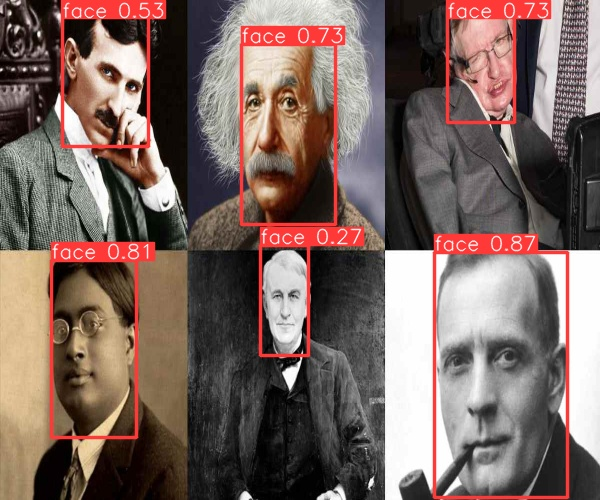

# Face Detection With Yolov8

## Installation
Download the face detection repository:
`git clone https://github.com/Yusuf-ozen/face_detection_with_yolov8.git` 

Install all necessary library:
`pip install -r requirements.txt` 

Navigate to the project directory:
`cd face_detection_with_yolov8` 

## Testing On Real-Time Webcam
Run this code at git bash or cmd:
`python live_test.py` 

## Testing on an Image
Run this code at git bash or cmd and change `/path/image` according your files. Using `--resize_width 400` and `--resize_height 400` the size of output image can change:

`python image_test.py /path/image.jpg --resize_width 400 --resize_height 300` 

## Testing on a Video
`python video_test.py /path/video.mp4 --resize_width 1280 --resize_height 720` 

 

